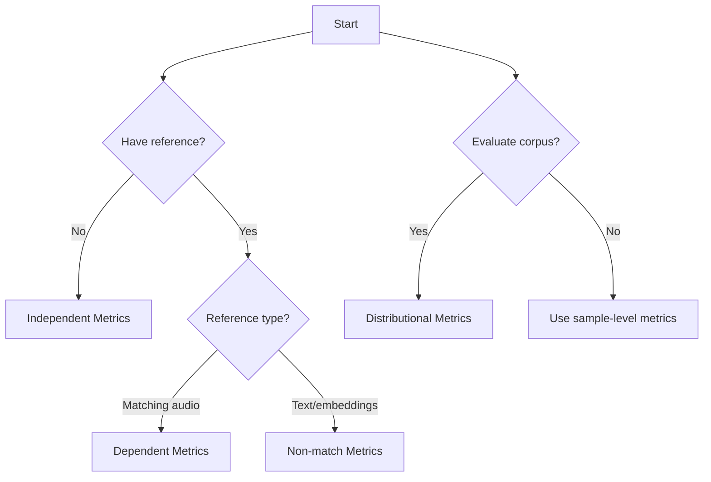

VERSA organizes metrics into four distinct categories based on their reference requirements and evaluation approach. Understanding these types helps you choose the right metrics for your evaluation needs.

## Overview

The four metric categories are:

<CardGroup cols={2}>
  <Card title="Independent" icon="star" color="#3b82f6">
    No reference required - evaluate audio directly
  </Card>
  <Card title="Dependent" icon="arrows-left-right" color="#8b5cf6">
    Require matching reference audio for comparison
  </Card>
  <Card title="Non-match" icon="shuffle" color="#ec4899">
    Use non-matching references like text or embeddings
  </Card>
  <Card title="Distributional" icon="chart-scatter" color="#f59e0b">
    Evaluate distributions across entire datasets
  </Card>
</CardGroup>

## Independent Metrics

Independent metrics evaluate audio quality without requiring any reference. These are ideal for quick assessments and scenarios where ground truth is unavailable.

### Common Use Cases

- MOS (Mean Opinion Score) prediction
- Speech quality assessment
- Audio property detection
- Speaker characteristic analysis

### Example Metrics

<Tabs>
  <Tab title="DNSMOS">
    Deep Noise Suppression MOS Score - predicts perceived quality without reference.
    
    ```yaml
    - name: pseudo_mos
      predictor_types: ["dnsmos"]
      predictor_args:
        dnsmos:
          fs: 16000
    ```
    
    **Output Keys**: `dnsmos_overall`, `dnsmos_p808`
  </Tab>
  
  <Tab title="NISQA">
    Non-intrusive Speech Quality and Naturalness Assessment.
    
    ```yaml
    - name: nisqa
    ```
    
    **Output Keys**: `nisqa_mos_pred`, `nisqa_noi_pred`, `nisqa_dis_pred`, `nisqa_col_pred`, `nisqa_loud_pred`
  </Tab>
  
  <Tab title="UTMOS">
    UTokyo-SaruLab System for MOS prediction.
    
    ```yaml
    - name: pseudo_mos
      predictor_types: ["utmos"]
      predictor_args:
        utmos:
          fs: 16000
    ```
    
    **Output Key**: `utmos`
  </Tab>
  
  <Tab title="VAD">
    Voice Activity Detection - identifies speech segments.
    
    ```yaml
    - name: vad
    ```
    
    **Output Key**: `vad_info`
  </Tab>
</Tabs>

<Info>
  Most independent metrics in VERSA are auto-installed and ready to use without additional setup.
</Info>

### Advanced Independent Metrics

VERSA includes sophisticated independent metrics powered by audio-language models:

<AccordionGroup>
  <Accordion title="Qwen2 Audio Metrics">
    The Qwen2 Audio model provides detailed analysis across multiple dimensions:
    
    **Speaker Characteristics**: gender, age, count, speech impairment  
    **Voice Properties**: pitch, pitch range, voice type, volume level  
    **Speech Content**: language, register, vocabulary complexity, purpose  
    **Speech Delivery**: emotion, clarity, rate, style, emotional vocalizations  
    **Environment**: background, recording quality, channel type
    
    Example configuration:
    ```yaml
    - name: qwen2_speaker_gender_metric
    - name: qwen2_voice_pitch_metric
    - name: qwen2_speech_emotion_metric
    ```
  </Accordion>
  
  <Accordion title="Speech Enhancement Metrics">
    Evaluate quality using reference SE models:
    
    ```yaml
    - name: se_snr
      model_tag: default
    ```
    
    **Output Keys**: `se_si_snr`, `se_ci_sdr`, `se_sar`, `se_sdr`
  </Accordion>
  
  <Accordion title="PAM (Prompting Audio-Language Models)">
    Quality assessment using audio-language model prompting:
    
    ```yaml
    - name: pam
    ```
    
    **Output Key**: `pam`
  </Accordion>
</AccordionGroup>

## Dependent Metrics

Dependent metrics require a matching reference audio file for comparison. These provide precise measurements of differences between generated and reference audio.

### Requirements

<Note>
  Dependent metrics need both:
  - `--pred`: Your generated/predicted audio
  - `--gt`: Ground truth reference audio with matching file IDs
</Note>

### Example Metrics

<Tabs>
  <Tab title="MCD & F0">
    Mel Cepstral Distortion and F0 analysis for voice conversion and TTS.
    
    ```yaml
    - name: mcd_f0
      f0min: 40
      f0max: 800
      mcep_shift: 5
      mcep_fftl: 1024
      mcep_dim: 39
      mcep_alpha: 0.466
      seq_mismatch_tolerance: 0.1
      power_threshold: -20
      dtw: true
    ```
    
    **Output Keys**: `mcd`, `f0_corr`, `f0_rmse`
    
    <Info>
      Set `dtw: true` for TTS evaluation, `dtw: false` for codec evaluation
    </Info>
  </Tab>
  
  <Tab title="Signal Metrics">
    Various signal-to-noise and distortion ratios.
    
    ```yaml
    - name: signal_metric
    ```
    
    **Output Keys**: `sir`, `sar`, `sdr`, `ci-sdr`, `si-snr`
  </Tab>
  
  <Tab title="PESQ & STOI">
    Industry-standard perceptual quality metrics.
    
    ```yaml
    - name: pesq
    - name: stoi
    ```
    
    **Output Keys**: `pesq`, `stoi`
  </Tab>
  
  <Tab title="Discrete Speech">
    Token-level comparison using discrete representations.
    
    ```yaml
    - name: discrete_speech
    ```
    
    **Output Keys**: `speech_bert`, `speech_bleu`, `speech_token_distance`
  </Tab>
</Tabs>

### Perceptual Audio Metrics

<AccordionGroup>
  <Accordion title="DPAM - Deep Perceptual Audio Metric">
    Learned perceptual distance between audio pairs:
    
    ```yaml
    - name: dpam
    ```
    
    **Output Key**: `dpam_distance`
  </Accordion>
  
  <Accordion title="CDPAM - Contrastive DPAM">
    Contrastive learning-based perceptual metric:
    
    ```yaml
    - name: cdpam
    ```
    
    **Output Key**: `cdpam_distance`
  </Accordion>
  
  <Accordion title="Log-WMSE">
    Frequency-weighted mean squared error:
    
    ```yaml
    - name: log_wmse
    ```
    
    **Output Key**: `log_wmse`
  </Accordion>
</AccordionGroup>

## Non-match Metrics

Non-match metrics use references that don't need to match the evaluated audio exactly. This includes text transcriptions, speaker embeddings, or semantic descriptions.

### Reference Types

<CardGroup cols={3}>
  <Card title="Text" icon="text">
    Transcription or description
  </Card>
  <Card title="Embeddings" icon="vector-square">
    Speaker or emotion vectors
  </Card>
  <Card title="Semantic" icon="brain">
    Content-based comparison
  </Card>
</CardGroup>

### Example Metrics

<Tabs>
  <Tab title="WER Metrics">
    Word/Character Error Rate using ASR systems.
    
    ```yaml
    # ESPnet ASR
    - name: espnet_wer
      model_tag: default
      beam_size: 5
      text_cleaner: whisper_basic
    
    # OWSM (Open Whisper-style Speech Model)
    - name: owsm_wer
      model_tag: default
      beam_size: 5
      text_cleaner: whisper_basic
    
    # OpenAI Whisper
    - name: whisper_wer
      model_tag: default
      beam_size: 1
      text_cleaner: whisper_basic
    ```
    
    **Output Keys**: `{model}_wer_delete`, `{model}_wer_insert`, `{model}_wer_replace`, `{model}_wer_equal`
  </Tab>
  
  <Tab title="Speaker Similarity">
    Compare speaker embeddings regardless of content.
    
    ```yaml
    - name: speaker
      model_tag: default
    ```
    
    **Output Key**: `spk_similarity`
    
    <Note>
      Uses ESPnet speaker verification models. Check [ESPnet HuggingFace](https://huggingface.co/espnet) for available models.
    </Note>
  </Tab>
  
  <Tab title="TorchAudio SQUIM">
    Reference-based MOS with non-matching reference.
    
    ```yaml
    - name: squim_ref
    ```
    
    **Output Key**: `torch_squim_mos`
  </Tab>
  
  <Tab title="ASR Match">
    Calculate correct word/character match rate.
    
    ```yaml
    - name: asr_match
      model_tag: default
      beam_size: 1
      text_cleaner: whisper_basic
    ```
    
    **Output Key**: `asr_match_error_rate`
  </Tab>
</Tabs>

### Advanced Non-match Metrics

<AccordionGroup>
  <Accordion title="Uni-VERSA with References">
    Versatile assessment with different reference types:
    
    ```yaml
    # Text reference
    - name: universa_textref
    
    # Audio + Text (full reference)
    - name: universa_fullref
    ```
    
    **Output Key**: `universa_score`
  </Accordion>
  
  <Accordion title="CLAP Score">
    Contrastive Language-Audio Pretraining similarity:
    
    ```yaml
    - name: clap_score
    ```
    
    **Output Key**: `clap_score`
  </Accordion>
  
  <Accordion title="Emotion Similarity">
    Compare emotional content using emotion2vec:
    
    ```yaml
    - name: emo2vec_similarity
    ```
    
    **Output Key**: `emotion_similarity`
  </Accordion>
</AccordionGroup>

## Distributional Metrics

Distributional metrics evaluate entire datasets rather than individual samples. They measure statistical properties and distribution characteristics.

<Warning>
  Distributional metrics require a corpus of audio files and are marked as "in verifying" status. Use with caution in production.
</Warning>

### Example Metrics

<Tabs>
  <Tab title="FAD">
    Frechet Audio Distance - measures distribution similarity.
    
    ```yaml
    - name: fad
      fad_embedding: default
      cache_dir: versa_cache/fad
      use_inf: true
      io: kaldi
    ```
    
    **Available Embeddings**:
    - `default` / `clap-laion-audio`
    - `clap-2023`, `clap-laion-music`
    - `vggish`
    - `mert-{layer_num}` (1-12)
    - `wav2vec2-base-{layer_num}` (1-12)
    - `wav2vec2-large-{layer_num}` (1-24)
    - `hubert-base/large-{layer_num}`
    - `wavlm-base/large-{layer_num}`
    - `whisper-{size}` (tiny/small/base/medium/large)
    - `dac`, `encodec-24k`, `encodec-48k`
    - `cdpam-acoustic`, `cdpam-music`
    
    **Output Keys**: `fad_overall`, `fad_r2`
  </Tab>
  
  <Tab title="KL Divergence">
    Kullback-Leibler divergence on embedding distributions.
    
    ```yaml
    - name: kl_embedding
    ```
    
    **Output Key**: `kl_embedding`
  </Tab>
  
  <Tab title="Density & Coverage">
    Audio generation quality metrics.
    
    ```yaml
    - name: audio_density_coverage
    ```
    
    **Output Keys**: `audio_density`, `audio_coverage`
  </Tab>
</Tabs>

## Choosing the Right Metric Type

Use this decision guide to select appropriate metrics:



<CardGroup cols={2}>
  <Card title="Quick Quality Check" icon="gauge-high">
    Use **Independent** metrics like DNSMOS, UTMOS, or NISQA
  </Card>
  <Card title="Precise Comparison" icon="equals">
    Use **Dependent** metrics like MCD, PESQ, or STOI
  </Card>
  <Card title="Content Verification" icon="spell-check">
    Use **Non-match** metrics like WER or Speaker Similarity
  </Card>
  <Card title="Dataset Analysis" icon="database">
    Use **Distributional** metrics like FAD
  </Card>
</CardGroup>

## Next Steps

<CardGroup cols={2}>
  <Card title="Configuration" icon="gear" href="/concepts/configuration">
    Learn how to configure metrics in YAML
  </Card>
  <Card title="Input Formats" icon="file-audio" href="/concepts/input-formats">
    Understand supported input formats
  </Card>
  <Card title="Metrics Reference" icon="book" href="/metrics/overview">
    Browse all available metrics
  </Card>
  <Card title="Quickstart" icon="rocket" href="/quickstart">
    See metric configurations in action
  </Card>
</CardGroup>
